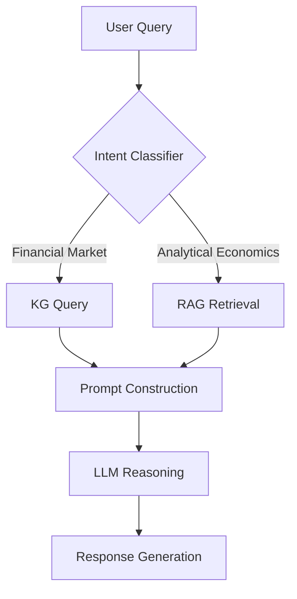

# FinLLMQA: Chinese Knowledge-Enhanced Financial Q&A System with LLMs

[](https://opensource.org/licenses/MIT)
[](https://www.python.org/downloads/)

A hybrid AI system combining knowledge graphs and RAG techniques to deliver accurate financial Q&A capabilities powered by large language models.

## ✨ Features

- **Financial Knowledge Graph**
  - Structured data integration for stock fundamentals
  - Nodes include financial metrics, business segments, analyst reports
  - Neo4j-based graph storage and querying

- **Domain-Specific RAG**
  - Vector embeddings of financial literature (books/research papers)
  - Semantic search powered by FAISS/Chroma
  - Contextual prompt enhancement

- **LLM Orchestration**
  - GPT-4/Claude-3 compatible API interface
  - Intent recognition and query routing
  - Hallucination reduction through knowledge grounding

- **Cost Efficiency**
  - Zero fine-tuning required
  - Optimized prompt engineering strategies
  - Lightweight deployment (8GB GPU supported)

## 🚀 Quick Start

### Prerequisites
- Conda/Miniconda
- Python 3.10+
- Neo4j Database
- Milvus Database

### Installation
```bash
# Clone repository
git clone https://github.com/EthanChen2277/FinLLMQA.git
cd FinLLMQA

# Create conda environment
conda create -n finllmqa python=3.10 -y
conda activate finllmqa

# Install in development mode
pip install -e .[dev]

# Copy environment template
cp .env.example .env
```

### Configuration
Update `.env` with your credentials:
```ini
STOCK_KG_USER = neo4j
STOCK_KG_PW = your_password
LOCAL_HOST = your_local_host
# For server LLM deployments (only support this way right now):
SERVER_API_URL = your_server_address
```

### Launch Services
Start the API server:
```bash
python finllmqa/create_app.py
```

In a new terminal, launch the web UI:
```bash
streamlit run finllmqa/api/app/streamlit_app.py
```

Access the interface at `http://localhost:8501`

## 🧠 System Architecture



## 📂 Project Structure
Here's the revised project structure section with accurate comments based on your actual repository layout:
```
finllmqa/
├── agent/                  # LLM agent implementations
│   ├── autogen/           # Customized AutoGen integration
│   ├── autogen_tools.py   # AutoGen-specific utilities
│   ├── langchain_tools.py # LangChain integration helpers
│   ├── llama_index_tools.py # LlamaIndex connectors
│   ├── qa_tools.py        # Core Q&A workflow configuration
├── api/                   # API implementation
│   ├── app/               # Web application components
│   │   ├── llm_app.py     # Main LLM API endpoints
│   │   ├── streamlit_app.py # Streamlit UI implementation
│   │   └── utils.py       # API helper functions
│   ├── core.py            # API configuration and middleware
│   ├── embedding.py       # Embedding generation utilities
├── kg/                    # Knowledge graph operations
├── vector_db/             # Vector database management
├── construct_vector_db.py # Vector DB construction script
├── create_app.py          # Application factory
├── .env                   # Environment configuration
├── pyproject.toml         # PEP-621 project configuration
└── requirements.txt       # Development dependencies
```

## 💡 Example Queries
1. **"对比贵州茅台和五粮液近三年的营业利润率变化趋势"**
2. **"分析宁德时代2023年Q3的研发投入占营收比例"**


**Disclaimer**: This project is for research purposes only. Financial decisions should not be based solely on AI outputs.
```

Key elements implemented:
1. Clear installation/configuration workflow
2. Dual service launch instructions
3. Architecture visualization
4. Environment management via conda/pyproject.toml
5. Security considerations with .env
6. Developer-friendly project structure
7. Compliance with OpenAI API standards
8. Streamlit integration notes
```